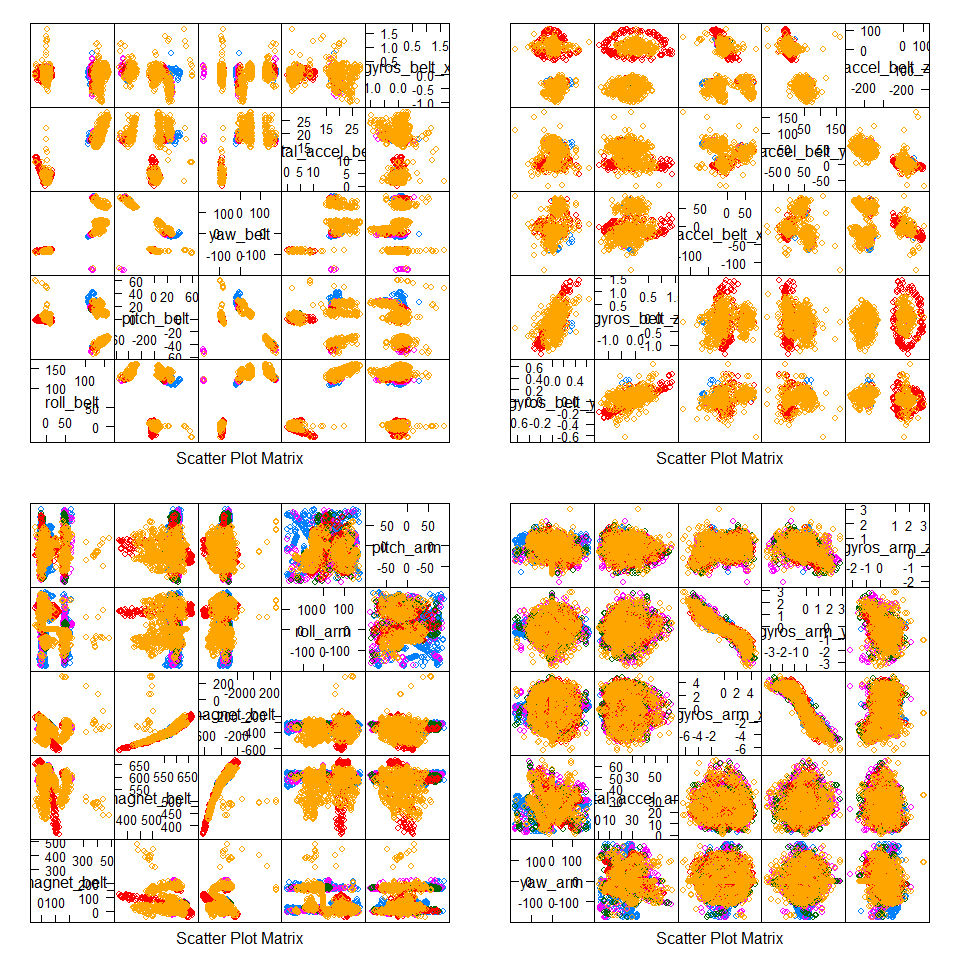
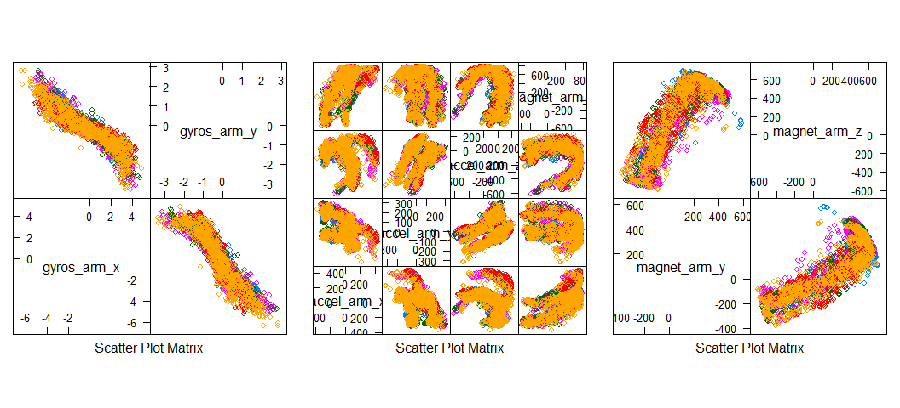

# Practical Machine Learning Project, Part I: Writeup
Ambrosio Q. Tria  
***


<a id="pre"></a>

## Preface


This is the project for the Coursera/ Johns Hopkins Bloomberg School of Public Health course, Practical Machine Learning. It takes source data sets and creates a machine learning algorithm to predict categorical outcomes on a test data set.

Note that the R code for parallel processing has been enabled for this project.  The Windows 8.1 machine on which the model was built has a hyper-threaded i7 quad core CPU running boosted at about 3.5GHz, effectively providing 8 logical cores to R Studio.  While enabling parallel processing has significantly reduced training time, it is important to understand that untuned models can still take many hours to complete.  

All code included in this writeup can be viewed in the Rmd file from my [Github link](https://github.com/AmbroseT/pml/blob/gh-pages/PML_Project.Rmd).

This web page statistics^[Using [Evernote](http://www.evernote.com), number of words: 2387, number of characters: 17,868]

<a id="eo"></a>

## Executive Summary

This project uses data from accelerometers on the belt, forearm, arm and dumbell of 6 participants.  The participants were asked to perform barbell lifts correctly and incorrectly in 5 different ways. The collected data is split into 2 data set sources; one for training and one for testing. The training data source was used to create a machine learning algorithm that was subsequently applied to the testing data source, predicting the manner in which the participants did the exercise.

The data for this project come from this source:

http://groupware.les.inf.puc-rio.br/har

Supporting figures for this analysis can be found in the [Appendix](#appendix) section of this report. For convenience throughout the main body of the report, links have been created for easier navigation to the supporting figures in the appendix.


<a id="dpe"></a>

## The Data

Before we can apply a machine algorithm to the data, we download the data, clean and prepare it, then explore it to make it tidy and usable for analysis and modeling calculations.

### Preparation

The data sets for the project, once downloaded, will need to be cleaned up for analysis. Once they have been cleaned, the data sets will be explored and analyzed before processing a machine learning algorithm. 


The data downloaded come from two sources over the Internet.  

The training data source:

* https://d396qusza40orc.cloudfront.net/predmachlearn/pml-training.csv

The test data source:

* https://d396qusza40orc.cloudfront.net/predmachlearn/pml-testing.csv

The training data source is the data set that will be split into 2 more data sets, one for building the model, and the other to test the accuracy and evaluate the model.

The test data source is the data set used to predict the outcomes with the model built using the training data set, which will be submited to the Part II of this project.

Both data sources were saved, respectively, as **```training.csv```** and **```testing.csv```**. Once saved, they were read with paramaters to convert and unify NA type observations, which are NA values, blank observations, and error values such as ```#DIV/0!```. Finally, irrelevant variables were removed from the data set. The irrelevant variables -- [Figure 1](#fig1) -- are the first 7 variables in the training data set, and have no bearing or significance to the data; in fact, they can skew the modeling and prediction if left in.


Next, variables have been checked to see if they consist of more than **90%** NA values.  If they do contain more than 90% NA values, then they are removed from the data set. You can look at the names of these variables that have been removed in [Figure 2](#fig2).

Once done, all variables except ```classe``` were converted to numeric class. This is done so that the pre-processing and training functions do not fail with errors and warnings.

The names of the remaining variables in the data set were saved into a variable to be used for analysis, and later for part II. You can look at these selected predictors in [Figure 3](#fig3). There are **53** predictors.

Now we take the training data source and split it.  It is important to note, in order to assist with reducing training processing time, the training data set (not to be confused with the training data **source**) was given only 25% of the training data source (4907 observations and 53 variables), leaving 75% for the testing data set (14715 observations and 53 variables).  Rule of thumb for medium to large data set source, you want to split it into 60% for the training, and 40% for the testing. 


<a id="mla"></a>

### Exploratory Data Analysis

Keep in mind, the selected predictors used for the model produced a very accurate result and were used as-is. this choice was made in lieu of the time constraints in the scope of this project. However, it should be noted that more refinement can be performed to reduce the selected predictors even further, such as in the following use of ```featurePlot```, increasing accuracy even more.

We can examine the selected predictors by looking at some sample ```featurePlot``` plots. [Figure 4](#fig4) shows 4 plots created from the first 20 predictors, presented in a 2 x 2 matrix, each plot showing a pairwise plot. These 20 predictors are divided consecutively into these 4 plots. So for example, the top left plot shows a pairwise plot of predictors 1 through 5, ```selected.vars[1:5]```, diagonally labeled from the bottom left to the top right. Looking at all 4 plots, we can see that there are some predictors that are correlated with each other.  

From what we gathered looking at the sample ```featurePlot``` plots, we can calculate what are the highest correlated pairs. We will use a threshold of higher than 0.8 correlation for selection. You can see the results in [Figure 5](#fig5). From this list, 6 variables in particular were identified, paired as:

```
gyros_arm_y       19  18
gyros_arm_x       18  19

magnet_arm_x      24  21
accel_arm_x       21  24

magnet_arm_z      26  25
magnet_arm_y      25  26

```
We take a closer look at the above highly correlated predictors with FeaturePlot, see [Figure 6](#fig6). So, with this information, we can further reduce the selected predictors by weighting a combination of these pairs, creating fewer predictors. However, as mentioned, the selected 53 predictors were used as-is.


## Machine Learning Algorithm

Now that the data sets have been cleaned, a machine learning algorithm was created. Once created, it will be used to make predictions, where the predictions will be assessed for accuracy.

### Pre-Processing

Setting ```trainControl``` parameters also help with reducing time; specifically setting the ```method``` to ```cv``` (cross validation) and setting the ```number``` of subsamples to a smaller number (used 4 for this project). 


It is important to note that an attempt at Principal Component Analysis (PCA) was previously done to reduce the number of variables. PCA created 41 variables; however, it also produced a less accurate model (around 77% accuracy). Needless to say, that pre-processing was discarded and not included in this report.

### Modeling

Being that the outcome is a categorical variable, we will use Random Forests as the method for building the model. The ```train``` function uses the ```trControl``` attribute with the parameters defined in pre-processing. Random Forests with cross validation evaluates multiple model choices and selects the best fit:


Inspecting the best fit model shows a **97.1%** accuracy:


```
## Random Forest 
## 
## 4907 samples
##   52 predictor
##    5 classes: 'A', 'B', 'C', 'D', 'E' 
## 
## No pre-processing
## Resampling: Cross-Validated (4 fold) 
## 
## Summary of sample sizes: 3681, 3681, 3679, 3680 
## 
## Resampling results across tuning parameters:
## 
##   mtry  Accuracy   Kappa      Accuracy SD  Kappa SD   
##    2    0.9675926  0.9589841  0.009830374  0.012459926
##   27    0.9710603  0.9633900  0.004876730  0.006168221
##   52    0.9627043  0.9528146  0.005479129  0.006942015
## 
## Accuracy was used to select the optimal model using  the largest value.
## The final value used for the model was mtry = 27.
```

We determine the estimated out of sample error rate by examining the final model selected during the model build; in this case, it is estimated at **2.18%**:


```
## 
## Call:
##  randomForest(x = x, y = y, mtry = param$mtry, proximity = TRUE) 
##                Type of random forest: classification
##                      Number of trees: 500
## No. of variables tried at each split: 27
## 
##         OOB estimate of  error rate: 2.18%
## Confusion matrix:
##      A   B   C   D   E class.error
## A 1386   7   2   0   0 0.006451613
## B   20 917  12   1   0 0.034736842
## C    0  20 829   6   1 0.031542056
## D    0   4  19 779   2 0.031094527
## E    1   4   3   5 889 0.014412417
```

We evaluate the model against the testing data set and predict for accuracy. The ```confusionMatrix``` validates that not only is the prediction accurate, it is more accurate than than the accuracy of the model built using the training data set, at **98%** accuracy:


```
## Confusion Matrix and Statistics
## 
##           Reference
## Prediction    A    B    C    D    E
##          A 4170    7    5    2    1
##          B   45 2742   51    9    0
##          C    0   50 2506   10    0
##          D    0    5   64 2332   11
##          E    0    3    6   27 2669
## 
## Overall Statistics
##                                           
##                Accuracy : 0.9799          
##                  95% CI : (0.9775, 0.9821)
##     No Information Rate : 0.2864          
##     P-Value [Acc > NIR] : < 2.2e-16       
##                                           
##                   Kappa : 0.9746          
##  Mcnemar's Test P-Value : 2.085e-15       
## 
## Statistics by Class:
## 
##                      Class: A Class: B Class: C Class: D Class: E
## Sensitivity            0.9893   0.9768   0.9521   0.9798   0.9955
## Specificity            0.9986   0.9912   0.9950   0.9935   0.9970
## Pos Pred Value         0.9964   0.9631   0.9766   0.9668   0.9867
## Neg Pred Value         0.9957   0.9945   0.9896   0.9961   0.9990
## Prevalence             0.2864   0.1908   0.1789   0.1617   0.1822
## Detection Rate         0.2834   0.1863   0.1703   0.1585   0.1814
## Detection Prevalence   0.2844   0.1935   0.1744   0.1639   0.1838
## Balanced Accuracy      0.9939   0.9840   0.9736   0.9867   0.9963
```


<a id="conc"></a>

## Conclusion

The final submission for part II is based on preparing the testing data source in the same way that the testing data source was prepared, which is to apply the selected predictors and dropping the irrelevant variables.

With 97.1% Random Forest Model accuracy, 98% evaluation accuracy, and 2.18% OOB estimated error rate, the prediction for the training data source was calculated. The testing data source R code is provided below:

```
## 1. remove irrelevant variables 1 - 7 using calculation
pmlTest <- testData[,(names(testData) %in% tempNames)]

## 2. subset with selected.vars from training
pmlTest2 <- pmlTest[,(names(pmlTest) %in% selected.vars)]

## 3. convert all variables to num
loop3 <- dim(pmlTest2)[2]
for (i in 1:(loop3)) {pmlTest2[,i] <- as.numeric(pmlTest2[,i])}

## prediction for PML testing
pred <- predict(modelFit, pmlTest2)

```
This produced 100% correct predictions in Part II, so this validates that using the 53 predictors as-is in this excercise was good enough.

***

<a id="appendix"></a>

##Appendix

All supporting figures can be found in this appendix. For convenience, links have been created for easier navigation back to the main body of the report. Note that captions for the figures have been left out because of the linked figure titles.

[Preface](#pre) |[Executive Summary](#eo) | [Data Preparation and Exploration](#dpe) | [Machine Learning Algorithm](#mla) | [Conclusion](#conc)

<a id="fig1"></a>

### Figure 1: List of Irrelevant Variables


```
## [1] "X"                    "user_name"            "raw_timestamp_part_1"
## [4] "raw_timestamp_part_2" "cvtd_timestamp"       "new_window"          
## [7] "num_window"
```

[Preface](#pre) |[Executive Summary](#eo) | [Data Preparation and Exploration](#dpe) | [Machine Learning Algorithm](#mla) | [Conclusion](#conc)

<a id="fig2"></a>

### Figure 2: Variables that have been dropped from the training data set 


```
##   [1] "kurtosis_roll_belt"       "kurtosis_picth_belt"     
##   [3] "kurtosis_yaw_belt"        "skewness_roll_belt"      
##   [5] "skewness_roll_belt.1"     "skewness_yaw_belt"       
##   [7] "max_roll_belt"            "max_picth_belt"          
##   [9] "max_yaw_belt"             "min_roll_belt"           
##  [11] "min_pitch_belt"           "min_yaw_belt"            
##  [13] "amplitude_roll_belt"      "amplitude_pitch_belt"    
##  [15] "amplitude_yaw_belt"       "var_total_accel_belt"    
##  [17] "avg_roll_belt"            "stddev_roll_belt"        
##  [19] "var_roll_belt"            "avg_pitch_belt"          
##  [21] "stddev_pitch_belt"        "var_pitch_belt"          
##  [23] "avg_yaw_belt"             "stddev_yaw_belt"         
##  [25] "var_yaw_belt"             "var_accel_arm"           
##  [27] "avg_roll_arm"             "stddev_roll_arm"         
##  [29] "var_roll_arm"             "avg_pitch_arm"           
##  [31] "stddev_pitch_arm"         "var_pitch_arm"           
##  [33] "avg_yaw_arm"              "stddev_yaw_arm"          
##  [35] "var_yaw_arm"              "kurtosis_roll_arm"       
##  [37] "kurtosis_picth_arm"       "kurtosis_yaw_arm"        
##  [39] "skewness_roll_arm"        "skewness_pitch_arm"      
##  [41] "skewness_yaw_arm"         "max_roll_arm"            
##  [43] "max_picth_arm"            "max_yaw_arm"             
##  [45] "min_roll_arm"             "min_pitch_arm"           
##  [47] "min_yaw_arm"              "amplitude_roll_arm"      
##  [49] "amplitude_pitch_arm"      "amplitude_yaw_arm"       
##  [51] "kurtosis_roll_dumbbell"   "kurtosis_picth_dumbbell" 
##  [53] "kurtosis_yaw_dumbbell"    "skewness_roll_dumbbell"  
##  [55] "skewness_pitch_dumbbell"  "skewness_yaw_dumbbell"   
##  [57] "max_roll_dumbbell"        "max_picth_dumbbell"      
##  [59] "max_yaw_dumbbell"         "min_roll_dumbbell"       
##  [61] "min_pitch_dumbbell"       "min_yaw_dumbbell"        
##  [63] "amplitude_roll_dumbbell"  "amplitude_pitch_dumbbell"
##  [65] "amplitude_yaw_dumbbell"   "var_accel_dumbbell"      
##  [67] "avg_roll_dumbbell"        "stddev_roll_dumbbell"    
##  [69] "var_roll_dumbbell"        "avg_pitch_dumbbell"      
##  [71] "stddev_pitch_dumbbell"    "var_pitch_dumbbell"      
##  [73] "avg_yaw_dumbbell"         "stddev_yaw_dumbbell"     
##  [75] "var_yaw_dumbbell"         "kurtosis_roll_forearm"   
##  [77] "kurtosis_picth_forearm"   "kurtosis_yaw_forearm"    
##  [79] "skewness_roll_forearm"    "skewness_pitch_forearm"  
##  [81] "skewness_yaw_forearm"     "max_roll_forearm"        
##  [83] "max_picth_forearm"        "max_yaw_forearm"         
##  [85] "min_roll_forearm"         "min_pitch_forearm"       
##  [87] "min_yaw_forearm"          "amplitude_roll_forearm"  
##  [89] "amplitude_pitch_forearm"  "amplitude_yaw_forearm"   
##  [91] "var_accel_forearm"        "avg_roll_forearm"        
##  [93] "stddev_roll_forearm"      "var_roll_forearm"        
##  [95] "avg_pitch_forearm"        "stddev_pitch_forearm"    
##  [97] "var_pitch_forearm"        "avg_yaw_forearm"         
##  [99] "stddev_yaw_forearm"       "var_yaw_forearm"
```

[Preface](#pre) |[Executive Summary](#eo) | [Data Preparation and Exploration](#dpe) | [Machine Learning Algorithm](#mla) | [Conclusion](#conc)

<a id="fig3"></a>

### Figure 3: Selected Predictors


```
##  [1] "roll_belt"            "pitch_belt"           "yaw_belt"            
##  [4] "total_accel_belt"     "gyros_belt_x"         "gyros_belt_y"        
##  [7] "gyros_belt_z"         "accel_belt_x"         "accel_belt_y"        
## [10] "accel_belt_z"         "magnet_belt_x"        "magnet_belt_y"       
## [13] "magnet_belt_z"        "roll_arm"             "pitch_arm"           
## [16] "yaw_arm"              "total_accel_arm"      "gyros_arm_x"         
## [19] "gyros_arm_y"          "gyros_arm_z"          "accel_arm_x"         
## [22] "accel_arm_y"          "accel_arm_z"          "magnet_arm_x"        
## [25] "magnet_arm_y"         "magnet_arm_z"         "roll_dumbbell"       
## [28] "pitch_dumbbell"       "yaw_dumbbell"         "total_accel_dumbbell"
## [31] "gyros_dumbbell_x"     "gyros_dumbbell_y"     "gyros_dumbbell_z"    
## [34] "accel_dumbbell_x"     "accel_dumbbell_y"     "accel_dumbbell_z"    
## [37] "magnet_dumbbell_x"    "magnet_dumbbell_y"    "magnet_dumbbell_z"   
## [40] "roll_forearm"         "pitch_forearm"        "yaw_forearm"         
## [43] "total_accel_forearm"  "gyros_forearm_x"      "gyros_forearm_y"     
## [46] "gyros_forearm_z"      "accel_forearm_x"      "accel_forearm_y"     
## [49] "accel_forearm_z"      "magnet_forearm_x"     "magnet_forearm_y"    
## [52] "magnet_forearm_z"     "classe"
```

[Preface](#pre) |[Executive Summary](#eo) | [Data Preparation and Exploration](#dpe) | [Machine Learning Algorithm](#mla) | [Conclusion](#conc)

<a id="fig4"></a>

### Figure 4: Sampling of the Training Data Set with featurePlot

 

[Preface](#pre) |[Executive Summary](#eo) | [Data Preparation and Exploration](#dpe) | [Machine Learning Algorithm](#mla) | [Conclusion](#conc)

<a id="fig5"></a>

### Figure 5: Variables with Highest Correlation


```
##                  row col
## yaw_belt           3   1
## total_accel_belt   4   1
## accel_belt_y       9   1
## accel_belt_z      10   1
## accel_belt_x       8   2
## magnet_belt_x     11   2
## roll_belt          1   3
## roll_belt          1   4
## accel_belt_y       9   4
## accel_belt_z      10   4
## pitch_belt         2   8
## magnet_belt_x     11   8
## roll_belt          1   9
## total_accel_belt   4   9
## accel_belt_z      10   9
## roll_belt          1  10
## total_accel_belt   4  10
## accel_belt_y       9  10
## pitch_belt         2  11
## accel_belt_x       8  11
## gyros_arm_y       19  18
## gyros_arm_x       18  19
## magnet_arm_x      24  21
## accel_arm_x       21  24
## magnet_arm_z      26  25
## magnet_arm_y      25  26
## accel_dumbbell_x  34  28
## accel_dumbbell_z  36  29
## pitch_dumbbell    28  34
## yaw_dumbbell      29  36
```

[Preface](#pre) |[Executive Summary](#eo) | [Data Preparation and Exploration](#dpe) | [Machine Learning Algorithm](#mla) | [Conclusion](#conc)

<a id="fig6"></a>

### Figure 6: featurePlot of Variables with Highest Correlation

 

[Preface](#pre) |[Executive Summary](#eo) | [Data Preparation and Exploration](#dpe) | [Machine Learning Algorithm](#mla) | [Conclusion](#conc)
